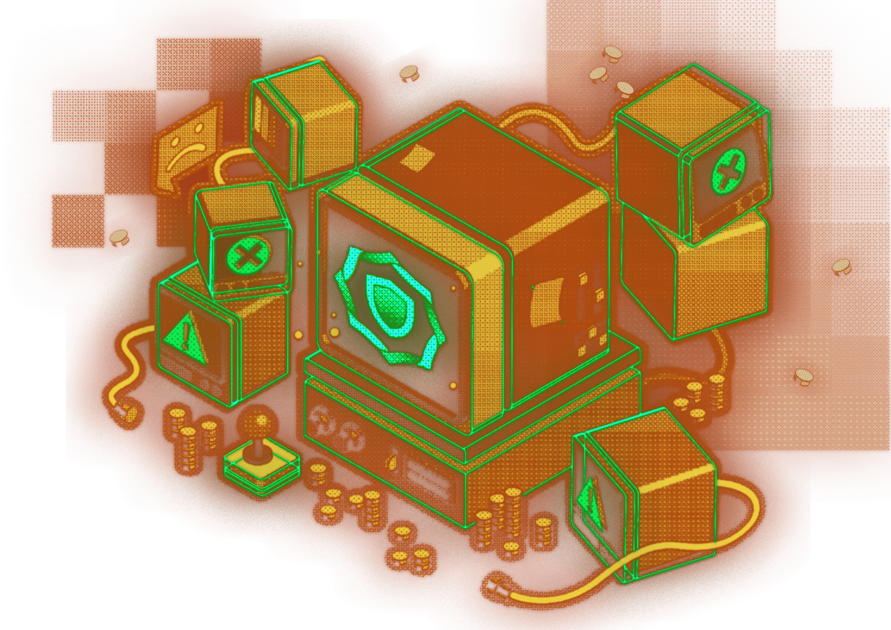

---
# Installation
It requires [install sui](https://docs.sui.io/guides/developer/getting-started/sui-install) to be installed on your machine.

If you didn't install sui, install it using:

```powershell
cargo install --locked --git https://github.com/MystenLabs/sui.git --branch devnet sui
```

Upon installation complete, type on terminal:

```powershell
sui -V
```
## Link to the Sui
The *Hakifi* smartcontracts utilize `sui` and `std` library packages. Those packages are installed with the sui client.

In this repository, open the `Move.toml` in the root folder.
In the `[dependencies]` section set the correct path to Sui packages:

```toml
Sui = { local = "../sui/crates/sui-framework" }
```

The **sui** code will be installed to the `<user folder>/sui`.

*For example on Windows:*
*`C:\Users\<user name>\sui`.*

That means, sui packages will be in `C:\Users\<user name>\sui\crates\sui-framework`.

### Error handling
*If the `sui publish` command gives **a client-server version mismatch** error, then you should install the exact version:*

```powershell
cargo install --git `
https://github.com/MystenLabs/sui.git `
--tag devnet-0.27.1 sui --force
```
---
## Create network environment

```powershell
$ sui client new-env --alias=mainnet --rpc https://fullnode.mainnet.sui.io:443
```
Added new Sui env [mainnet] to config.

### Set current environment
```powershell
$ sui client switch --env mainnet
```
Active environment switched to [mainnet]

or 

```powershell
$ sui client switch --env devnet
```
Active environment switched to [devnet]

### Faucet sui devnet
```powershell
$ sui client faucet
```
Check balance
```powershell
$ sui client gas
```

### Check active address

```powershell
$ sui client active-address  
```
---
## Build

```powershell
$ sui move build
```

Compile the smartcontract source code to the binary.

---

# Deploy

> You may need SUI token to publish or call functions.
> To obtain a gas for devnet check out https://docs.sui.io/build/faucet

Deploy the smartcontracts on the blockchain.

```powershell
sui client publish --gas-budget "gas budget" --skip-dependency-verification
```
example:
```powershell
sui client publish --gas-budget 100000000 --skip-dependency-verification
```

Upon successful publishing, the console output will show
Transaction Hash. Then we need to update the game backend to work with the newly published data.

## Sui tutorials

The list of references used in the writing of these smartcontracts:

* https://github.com/MystenLabs/sui &ndash; source code with all links to start to work with Sui blockchain.
* https://docs.sui.io/devnet/explore &ndash; primary hub of the documentations.
* https://github.com/MystenLabs/sui/blob/main/doc/src/explore/examples.md &ndash; primary hub of the examples.
* https://github.com/MystenLabs/sui/blob/main/sui_programmability/examples/nfts/sources/marketplace.move &ndash; NFT marketplace, used to see how to import/export NFT into MiniMiners game smartcontract.
* https://github.com/MystenLabs/sui-axelar/blob/2a0f17ab8efdb8ebc6bca753328180a02f6fcf6e/presets/index.js#L108 &ndash; example on how to generate the signatures offchain, then verifying them on-chain using `ecrecover` function.
* https://github.com/MystenLabs/sui/tree/main/sdk/typescript/ &ndash; the SDK to interact with Sui blockchain from Node.js and browser backends.
* https://move-language.github.io/move/vector.html &ndash; Move programming language book. The link is the page describing array like data structures: vectors.
* https://github.com/MystenLabs/sui/blob/main/doc/src/build/install.md#sui-tokens &ndash; How to obtain devnet SUI token.
* https://explorer.sui.io/ &ndash; explore the blocks and transactions.
* https://github.com/move-language/move/tree/main/language/documentation/tutorial &ndash; official tutorial on move programming language.
* https://github.com/MystenLabs/awesome-move#move-powered-blockchains &ndash; list of useful recource collection related to Move programming language.